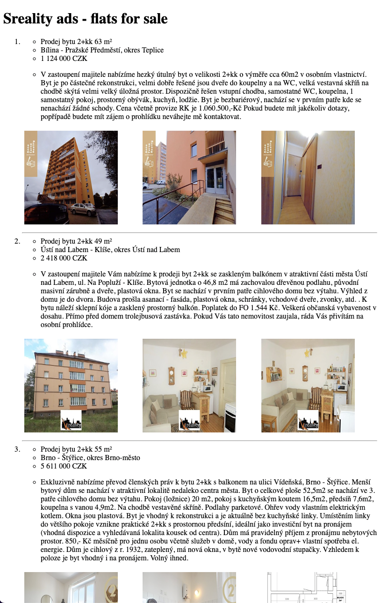

# Sreality ads scraper

## Overview
Simple project consisting of three services
- `db`: Postgres persistent database
- `ads-crawler`: scrapes estate ads (flats, sell) from [sreality](https://www.sreality.cz) and persists them into postgres database
- `api`: simple web app to render scraped ads

## Requirements
- `docker`
- `docker-compose`

## Usage
Open your terminal and run following commands in given order:
```
$ git clone git@github.com:czernalex/sreality_ads.git
$ cd sreality_ads
$ docker-compose up -d --build
```
After all containers are successfully started, see the result [here](http://localhost:8080).

## Routes
### /
- renders scraped ads

### /api
```
 "data": [
    {
      "ad_detail": {
        "description": "Exkluzivně nabízíme dobře řešený byt s lodžií v zrenovovaném panelovém domě v atraktivní lokalitě v blízkosti metra. Byt je vybaven starší kuchyňskou linkou se spotřebiči. Byt je určen spíše k rekonstrukci. Možnost financování hypotéčním úvěrem se kterým Vám rádi pomůžeme.",
        "price": 7414000,
        "price_raw": "7 414 000"
      },
      "estate_id": "3351218268",
      "id": 1,
      "img_url_1": "https://d18-a.sdn.cz/d_18/c_img_gT_i/xzRaNY.jpeg?fl=res,400,300,3|shr,,20|jpg,90",
      "img_url_2": "https://d18-a.sdn.cz/d_18/c_img_gW_g/n0TaGc.jpeg?fl=res,400,300,3|shr,,20|jpg,90",
      "img_url_3": "https://d18-a.sdn.cz/d_18/c_img_gY_h/Y9IZt9.jpeg?fl=res,400,300,3|shr,,20|jpg,90",
      "locality": "Praha 8 - Bohnice",
      "name": "Prodej bytu 3+1 77 m²"
    },...
]
```